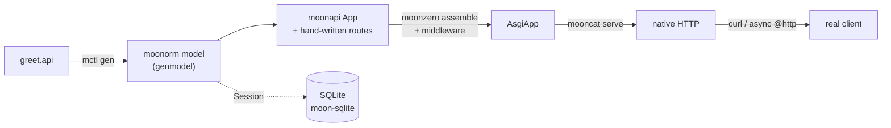

<div align="center">

# greet

**The end-to-end slice of the moon\* full-stack web suite.**

[](https://github.com/Lfan-ke/greet/actions/workflows/ci.yml)
[](./LICENSE)

</div>

`greet` is the acceptance test for the whole moon\* stack: one `.api` spec flows
through code generation, framework, assembly, ORM, and server, and a real HTTP
client hits the result over the wire. If this repo's CI is green, the pieces boot
and cooperate — that is the point of it.



## The chain

| stage | repo | what it does here |
|-------|------|-------------------|
| spec | — | `greet.api`: a `service` with `/ping`, `POST /users`, `GET /users/:id`, and a `type User` |
| generate | [moonctl](https://github.com/Lfan-ke/moonctl) (`mctl`) | `genmodel/`: the `User` model, columns, Row decoder, and migration |
| framework | [moonapi](https://github.com/Lfan-ke/moonapi) | routing, the OpenAPI document, the request-id middleware |
| assembly | [moonzero](https://github.com/Lfan-ke/moonzero) | wraps the app with go-zero-style request logging |
| ORM | [moonorm](https://github.com/Lfan-ke/moonorm) + [moondb](https://github.com/Lfan-ke/moondb) | the `Session` that persists and reads users |
| driver | [moon-sqlite](https://github.com/Lfan-ke/moon-sqlite) | a real SQLite file behind the Session |
| server | [mooncat](https://github.com/Lfan-ke/mooncat) | serves the assembled app over native HTTP |
| SEAM | [moonasgi](https://github.com/Lfan-ke/moonasgi) | the Scope/Receive/Send contract every layer shares |
| gRPC | [moonrpc](https://github.com/Lfan-ke/moonrpc) | serves greet.Greeter over h2c with Server Reflection (`rpc/`) |

Routes are hand-written — the ordinary goctl workflow, where generated
scaffolding is the starting point and the business logic is filled in — but the
generated `User` model stays the persistence layer, so a request still
round-trips through the exact model the spec produced.

mctl also generates a moonapi route scaffold (`@moonctl.generate`), and `gen`
runs it, but that output is not compiled here: the published `moonctl@0.6.0`
targets a pre-0.10.5 compiler where a pure named handler coerces to the raising
`ApiHandler`; under `moonc 0.10.5` that coercion is gone, so the scaffold's
`app.get(path, handler)` stubs no longer type-check. The routes are written by
hand instead.

## gRPC leg

`greet.proto` defines `Greeter.SayHello(HelloRequest) -> HelloReply`. `rpc/`
serves it over moonrpc's self-built HTTP/2 (h2c) transport with `grpc.reflection.v1`
Server Reflection registered. The test drives it the way `grpcurl` does — over a
real `@socket.Tcp`, through the in-process `Channel` client: `ListServices` sees
`greet.Greeter`, `FileContainingSymbol` returns its `FileDescriptorProto`, and a
unary `SayHello("Ada")` answers `"Hello, Ada"`.

## Run it

```console
$ moon run --target native gen           # regenerate genmodel/ from greet.api
$ moon test --target native              # in-process end-to-end: real @http client over a live socket
$ moon run --target native cmd/greet-server &
$ curl -s localhost:8080/ping            # -> pong
$ curl -s -XPOST localhost:8080/users -d '{"name":"Ada"}'
{"id":1,"name":"Ada"}
$ curl -s localhost:8080/users/1         # -> {"id":1,"name":"Ada"}
$ curl -s localhost:8080/openapi.json    # -> the OpenAPI document
```

## Layout

- `greet.api` — the spec.
- `gen/` — runs mctl over the spec and writes the generated model.
- `genmodel/` — mctl output, committed so the diff is visible and regenerated in
  CI so it stays honest.
- `server/` — the assembled service and the end-to-end test.
- `cmd/greet-server/` — the binary CI runs and curls.

## License

Apache-2.0.
